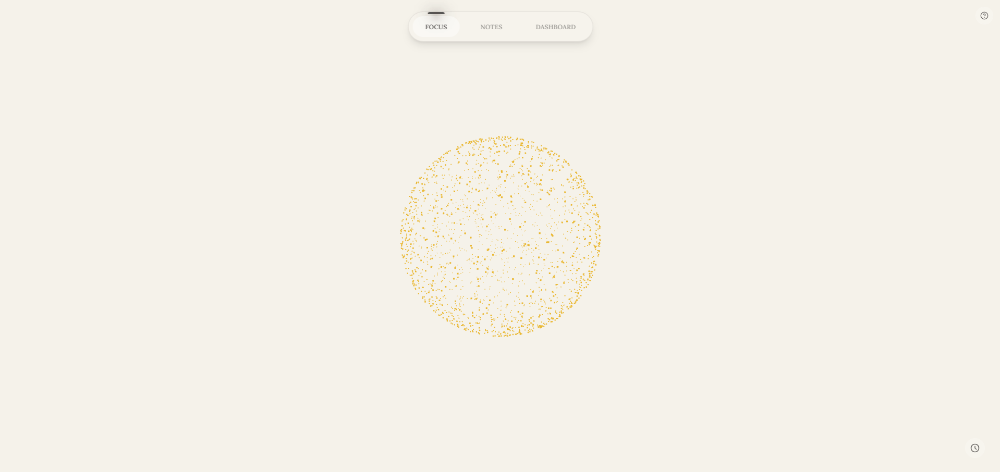

# FSSG - Focus Study Session Generator

<div align="center">
  
</div>

FSSG is a web application designed to help you focus and take notes during your study sessions, providing a distraction-free environment for your work and study sessions.

## Tech Stack
- React + TypeScript
- Vite for fast development and building
- Framer Motion for smooth animations
- Three.js + React Three Fiber for 3D visualizations
- TailwindCSS for styling
- Local storage for data persistence    

## Getting Started

### Prerequisites
- Node.js 16+ or Bun runtime
- npm, yarn, or bun package manager

### Installation

1. Clone the repository:
```bash
git clone https://github.com/herniqeu/focus.git
cd fssg
```

2. Install dependencies:
```bash
# Using npm
npm install

# Using yarn
yarn

# Using bun
bun install
```

3. Start the development server:
```bash
# Using npm
npm run dev

# Using yarn
yarn dev

# Using bun
bun dev
```

4. Open your browser and navigate to `http://localhost:5173`

## Data Storage
All data is stored locally in your browser using localStorage:
- Focus sessions are saved under the `focusSessions` key
- Notes are saved under the `notes` key

## Contributing
Contributions are welcome! Please feel free to submit a Pull Request.
